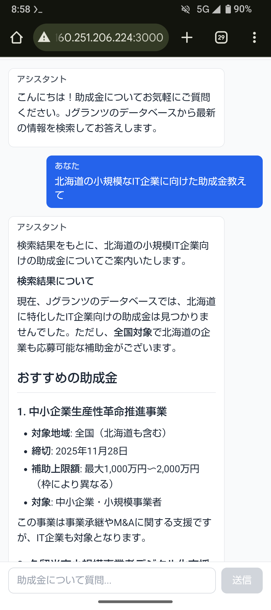
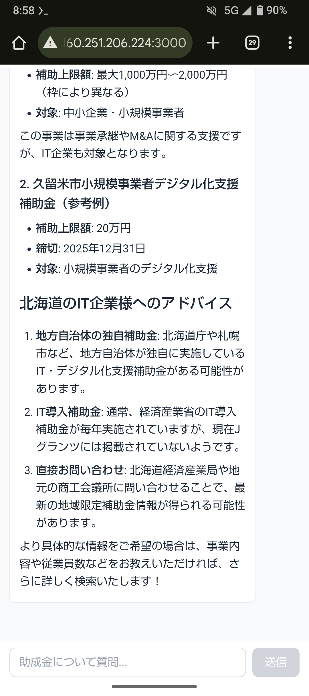

# 助成金アシスタント | Jグランツ検索システム

ChatGPT風のUIで助成金について質問できるAIアシスタントシステムです。デジタル庁が運営するJグランツ（補助金電子申請システム）のデータベースにアクセスして、最新の助成金情報を検索・提供します。

## 📱 アプリイメージ

<p align="center">
  
  
</p>

## 🚀 現在の仮実装環境

現在は開発環境として **http://160.251.206.224:3000** で仮アクセス可能です。

### ⚠️ 本格運用時に必要な設定

本番環境として正式に公開する場合は、以下のセキュリティ設定が必須です：

1. **Webサーバー設定**
   - Apache/Nginxでリバースプロキシを設定
   - 適切なエンドポイント（例: `/grants/`）を用意
   - HTTPSの有効化（Let's Encrypt推奨）

2. **ファイアウォール設定**
   - ポート3000を直接公開せず、80/443経由でアクセス
   - または、ポート3000を外部公開する場合は以下を実施：
     - ConoHaレンタルサーバーのセキュリティグループでポート3000を許可
     - UFW/iptablesでポート3000のアクセス制御

3. **セキュリティ強化**
   - 環境変数でAPIキーを管理（`.env.local`をgitignore）
   - レート制限の実装
   - CORS設定の適切な構成

現在の仮実装は開発・テスト目的であり、本番環境ではセキュリティリスクがあります。

## 🌟 特徴

- **ChatGPT風のUI**: 直感的でわかりやすい対話インターフェース
- **Jグランツ連携**: デジタル庁の公式データベースから最新情報を取得
- **Claude AI搭載**: Anthropic Claude Sonnet 4.5による高度な自然言語理解
- **Markdown表示対応**: リッチな書式での情報表示
- **モバイル最適化**: Android タブレットでの快適な操作性

## 🏗️ アーキテクチャ

```
[ブラウザ]
    ↓
[Next.js Webアプリ (ポート3000)]
    ↓
[Claude AI + MCPクライアント]
    ↓
[JグランツMCPサーバー (ポート8000)]
    ↓
[Jグランツ公開API]
```

## 📦 技術スタック

### フロントエンド
- Next.js 16 (App Router)
- React 19
- TypeScript
- Tailwind CSS

### バックエンド
- Anthropic Claude API (Claude Sonnet 4.5)
- FastMCP (Python) ※現在は直接API呼び出しを使用
- JグランツAPI

## 🚀 セットアップ

### 前提条件

- Node.js 22.16.0以上
- Python 3.10以上
- Anthropic APIキー

### インストール

1. **依存関係のインストール**

```bash
# Python仮想環境のセットアップ（既に完了済み）
cd jgrants-mcp
source venv/bin/activate
pip install -r requirements.txt

# Node.js依存関係（既に完了済み）
cd ../frontend
npm install
```

2. **環境変数の設定**

`frontend/.env.local`ファイルに以下を設定（既に設定済み）:

```env
ANTHROPIC_API_KEY=your_api_key_here
MCP_SERVER_URL=http://127.0.0.1:8000
```

## 🎯 使い方

### サービスの起動

**簡単起動:**

```bash
chmod +x start-services.sh
./start-services.sh
```

**手動起動:**

```bash
# 1. MCPサーバーを起動
cd jgrants-mcp
source venv/bin/activate
python server.py &

# 2. Next.jsアプリを起動
cd ../frontend
npm run dev
# または本番モード
npm run build && npm run start
```

### サービスの停止

```bash
./stop-services.sh
```

### アクセス

ブラウザで以下にアクセス:
- **Webアプリ**: http://localhost:3000
- **MCPサーバー**: http://localhost:8000/sse

## 💬 使用例

1. ブラウザでWebアプリにアクセス
2. テキストボックスに質問を入力

例:
- 「IT関連の補助金を教えて」
- 「中小企業向けの助成金はありますか？」
- 「環境分野の補助金で締切が近いものは？」

3. アシスタントがJグランツから最新情報を検索して回答

## 🛠️ 開発

### ディレクトリ構成

```
grant-gov-assistant/
├── jgrants-mcp/          # JグランツMCPサーバー
│   ├── server.py         # MCPサーバー本体
│   ├── requirements.txt  # Python依存関係
│   └── venv/            # Python仮想環境
├── frontend/            # Next.jsアプリ
│   ├── app/            # App Router
│   │   ├── page.tsx    # メインページ
│   │   └── api/        # APIルート
│   ├── lib/            # ライブラリ
│   │   ├── claude-agent.ts  # Claude AIエージェント
│   │   └── mcp-client.ts    # MCPクライアント
│   └── components/     # Reactコンポーネント
├── start-services.sh   # 起動スクリプト
├── stop-services.sh    # 停止スクリプト
└── README.md          # このファイル
```

### MCPツール

JグランツMCPサーバーは以下のツールを提供:

1. **list_subsidies**: キーワードで補助金を検索
2. **get_subsidy_detail**: 補助金の詳細情報を取得
3. **download_attachment**: 添付ファイルのダウンロードURL取得

## 📄 ライセンス

ISC

## 🙏 謝辞

- [デジタル庁](https://www.digital.go.jp/) - Jグランツ公開API提供
- [Anthropic](https://www.anthropic.com/) - Claude AI
- [FastMCP](https://github.com/modelcontextprotocol/fastmcp) - MCPフレームワーク
